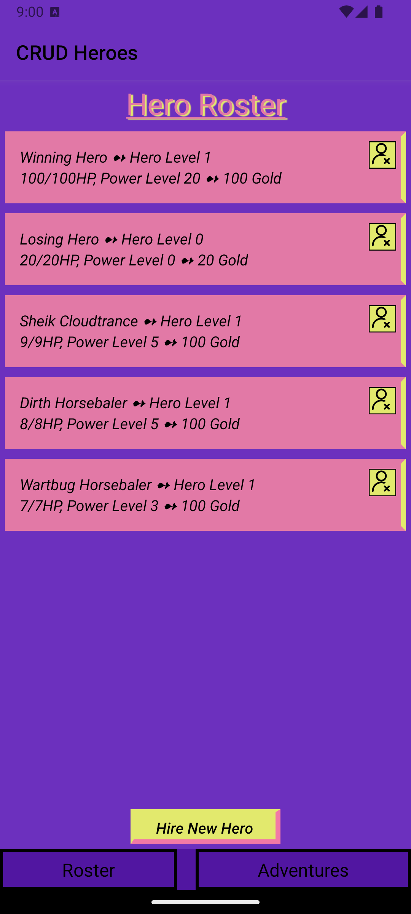

# Installation
Installation slides can be found [here](https://myuno-my.sharepoint.com/:p:/r/personal/jmspicer_uno_edu/Documents/Mobile%20Apps/Lectures/Lecture%201%20-%20Getting%20Everything%20Set%20Up.pptx?d=w9e4fd3609818455fb80f19524effd971&csf=1&web=1&e=P7NIBc).

## Preqeqs

* <b>Git</b>
* <b>Node</b>
    1. Type the following into the terminal:
        ```
        curl -o- https://raw.githubusercontent.com/creationix/nvm/v0.31.3/install.sh | bash
        ```
    2. Exit terminal and reopen.
    3. Type `nvm` and you will get a response if it worked.
    4. Install version 16: `nvm install 16`.
    5. Make your alias: `nvm alias default 16`.
    6. Verify that `node -v` returns the correct version.
* <b>NPM</b>
    1. Go to the directory the project is in and open a terminal window there.
    2. `npm install --legacy-peer-deps`
    3. You will see a folder named `node_modules` in the directory once done.
    4. `npm start`

# Running the projects

#### With the terminal
Use `npm start` in the terminal and scan the QR code that shows up. You will need the Expo Go app, where this QR code will redirect to.

#### With Android Studio
Open project in [Android Studio](https://developer.android.com/studio) > add a device in the Device Manager > `npm start` in the Android Studio terminal > press "a" for Android.

<br><br>
<p align="center"><p align="right"><i>HW3: CRUD Heroes</i></p></p>

### [HW3](https://github.com/Jenspi/mobiledev/tree/main/HW3_CRUD_Adventures/CRUD)
→ A game closely modeled after our Blog project, which was worked on together in class. Following CRUD, you can **C**reate randomly generated heroes, **R**ead heroes listed in the rosters, **U**pdate by sending heroes to complete missions, and **D**elete heroes with bad rolls or that have died. Individual work.