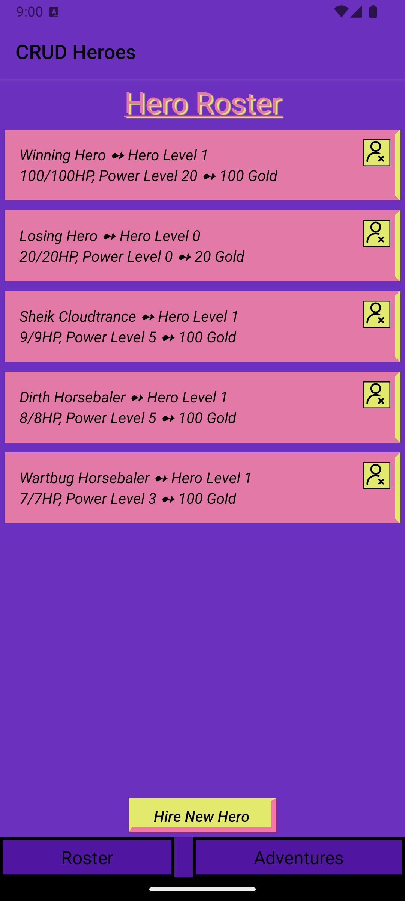

# ⏯️ [YouTube Playlist](https://www.youtube.com/playlist?list=PLP778E1KKtqnU2CbDrfC29ElyXJ8sVIdF)

# Installation

Installation slides can be found [here](https://myuno-my.sharepoint.com/:p:/r/personal/jmspicer_uno_edu/Documents/Mobile%20Apps/Lectures/Lecture%201%20-%20Getting%20Everything%20Set%20Up.pptx?d=w9e4fd3609818455fb80f19524effd971&csf=1&web=1&e=P7NIBc).

## Preqeqs

* <b>Git</b>
* <b>Node</b>
    1. Type the following into the terminal:
        ```
        curl -o- https://raw.githubusercontent.com/creationix/nvm/v0.31.3/install.sh | bash
        ```
    2. Exit terminal and reopen.
    3. Type `nvm` and you will get a response if it worked.
    4. Install version 16: `nvm install 16`.
    5. Make your alias: `nvm alias default 16`.
    6. Verify that `node -v` returns the correct version.
* <b>NPM</b>
    1. Go to the directory the project is in and open a terminal window there.
    2. `npm install --legacy-peer-deps`
    3. You will see a folder named `node_modules` in the directory once done.
    4. `npm start`

# Running the projects

#### With the terminal
Use `npm start` in the terminal and scan the QR code that shows up. You will need the Expo Go app, where this QR code will redirect to.

#### With Android Studio
Open project in [Android Studio](https://developer.android.com/studio) > add a device in the Device Manager > `npm start` in the Android Studio terminal > press "a" for Android.

# Common debugging

* <b>ReadableStream not defined:</b>
```
ReferenceError: ReadableStream is not defined
at Object.<anonymous> ...........
```
1. Update node to version 18 with the following:
    1. Install version 16: `nvm install 18`.
    2. Make your alias: `nvm alias default 18`.
    3. Verify that `node -v` returns the correct version.

* <b>Permission denied:</b>
```
> expo start

sh: ....../node_modules/.bin/expo: Permission denied
```
1. Delete the expo file by running the command `cd node_modules/.bin`, then `sudo rm -rf expo`. *(this will not disrupt anything)*
2. Reinstall npm in the project root, if necessary, with `npm install`.

# Project Descriptions

<br><br>
<p align="center"><p align="right"><i>Main Code Directory</i></p></p>

### [Main Code](https://github.com/Jenspi/mobiledev/tree/main/Main%20code)
→ Main page, listing (almost, if not all) every project all on one page. Aesthetics currently not the best, because I was consistently adding to it throughout the semester. This project lists concepts and which projects we made with these new concepts. Individual work.

---
<br><br>
<p align="center"><p align="right"><i>Learning FlatLists</i></p></p>

### [Learning](https://github.com/Jenspi/mobiledev/tree/main/learning/Final%20Challenges/FlatList)
→ One challenge, learning to use flatlists (with a Pokémon theme). Individual work.

---
<br><br>
<p align="center"><p align="right"><i>HW1: Hello World!</i></p></p>


### [HW1](https://github.com/Jenspi/mobiledev/tree/main/HW1_HelloWorld)
→ Simple Hello World. Talked about my summer and went out of my way to make it scrollable, have color/font weight & styling, and have photos. Individual work.

---
<br><br>
<p align="center"><p align="right"><i>HW2: Combat Game</i></p></p>

### [HW2](https://github.com/Jenspi/mobiledev/tree/main/HW2_Combat)
→ [Unfinished] A turn-based mobile combat game. Could not get the monster to attack back and other small details. Individual work.

---
<br><br>
<p align="center"><p align="right"><i>HW3: CRUD Heroes</i></p></p>

### [HW3](https://github.com/Jenspi/mobiledev/tree/main/HW3_CRUD_Adventures/CRUD)
→ A game closely modeled after our Blog project, which was worked on together in class. Following CRUD, you can **C**reate randomly generated heroes, **R**ead heroes listed in the rosters, **U**pdate by sending heroes to complete missions, and **D**elete heroes with bad rolls or that have died. Individual work.

---
<br><br>
<p align="center"><i>Blog Application</i></p></p>

### [Blog](https://github.com/Jenspi/mobiledev/tree/main/blog/Blog)
→ Following the professor, we created a blog app using CRUD. This app was before learning persistent data.

---
<br><br>
<p align="center"><p align="right"><i>Yelp! Clone</i></p></p>

### [Food](https://github.com/Jenspi/mobiledev/tree/main/food)
→ Following the professor, we used the [Yelp! API](https://docs.developer.yelp.com/docs/fusion-intro) to create a Yelp! clone. RESTful API.

---
<br><br>
<p align="center"><p align="right"><i>Persistent Data</i></p></p>

### [jsonserver](https://github.com/Jenspi/mobiledev/tree/main/jsonserver)
→ [Unfinished] Server for persistent data.

# Group project

<p align="center">
<p align="right"><i>ScholarUp</i></p></p>

### [ScholarUp](https://github.com/Jenspi/ScholarUp)
<p>
Group project that ran for the entire semester!<br><br>
→ 🥇 ScholarUp won <b>1st Place</b> in oral presentations at <b><i>Innovate</i>UNO</b> in November 2023.<br>
→ 🎤 ScholarUp was presented at the <b>University of Louisiana Academic Summit</b> in April 2024.
</p>
