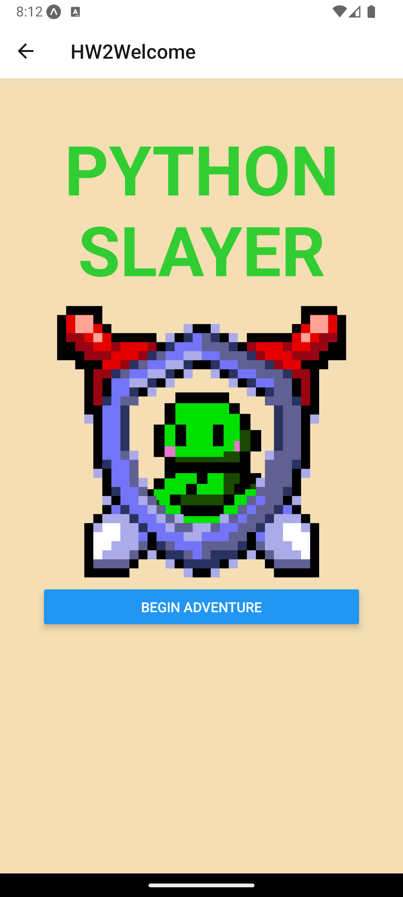
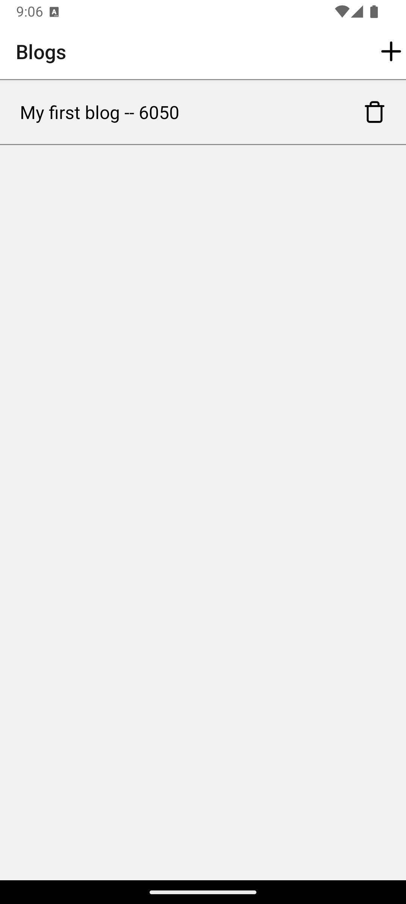

<p align="center"></p>

# 📲💗 <i>Mobile Applications Development</i> Projects List

## 📋 Table of Contents
- [📲💗 Mobile Applications Development Projects List](#-mobile-applications-development-projects-list)
  - [📋 Table of Contents](#-table-of-contents)
  - [📱 Applications](#-applications)
    - [Main Code](#main-code)
    - [Learning](#learning)
    - [HW1](#hw1)
    - [HW2](#hw2)
    - [HW3](#hw3)
    - [Blog](#blog)
    - [Food](#food)
    - [jsonserver](#jsonserver)
    - [Group project – ScholarUp](#group-project--scholarup)
  - [⚙️ Application Setup Requirements](#️-application-setup-requirements)
  - [✨ Application Installation](#-application-installation)
  - [🤳 Running Applications](#-running-applications)
      - [With Expo Go (mobile app)](#with-expo-go-mobile-app)
      - [With Android Studio](#with-android-studio)
      - [With Xcode](#with-xcode)
- [🪲 Common debugging](#-common-debugging)
  - [💡 Acknowledgements \& Resources](#-acknowledgements--resources)

## 📱 Applications

<br><br>
<p align="center"><p align="center"><i>Main Code Directory</i></p></p>

### [Main Code](https://github.com/Jenspi/mobiledev/tree/main/Main%20code)
→ Main page, listing (almost, if not all) every project all on one page. Aesthetics currently not the best, because I was consistently adding to it throughout the semester. This project lists concepts and which projects we made with these new concepts. Individual work.

---
<br><br>
<p align="center"><p align="center"><i>Learning FlatLists</i></p></p>

### [Learning](https://github.com/Jenspi/mobiledev/tree/main/learning/Final%20Challenges/FlatList)
→ One challenge, learning to use flatlists (with a Pokémon theme). Individual work.

---
<br><br>
<p align="center"><p align="center"><i>HW1: Hello World!</i></p></p>


### [HW1](https://github.com/Jenspi/mobiledev/tree/main/HW1_HelloWorld)
→ Simple Hello World. Talked about my summer and went out of my way to make it scrollable, have color/font weight & styling, and have photos. Individual work.

---
<br><br>
<p align="center"><p align="center"><i>HW2: Combat Game</i></p></p>

### [HW2](https://github.com/Jenspi/mobiledev/tree/main/HW2_Combat)
→ [Unfinished] A turn-based mobile combat game. Could not get the monster to attack back and other small details. Individual work.

---
<br><br>
<p align="center"><p align="center"><i>HW3: CRUD Heroes</i></p></p>

### [HW3](https://github.com/Jenspi/mobiledev/tree/main/HW3_CRUD_Adventures/CRUD)
→ A game closely modeled after our Blog project, which was worked on together in class. Following CRUD, you can **C**reate randomly generated heroes, **R**ead heroes listed in the rosters, **U**pdate by sending heroes to complete missions, and **D**elete heroes with bad rolls or that have died. Individual work.

---
<br><br>
<p align="center"><p align="center"><i>Blog Application</i></p></p>

### [Blog](https://github.com/Jenspi/mobiledev/tree/main/blog/Blog)
→ Following the professor, we created a blog app using CRUD. This app was before learning persistent data.

---
<br><br>
<p align="center"><p align="center"><i>Yelp! Clone</i></p></p>

### [Food](https://github.com/Jenspi/mobiledev/tree/main/food)
→ Following the professor, we used the [Yelp! API](https://docs.developer.yelp.com/docs/fusion-intro) to create a Yelp! clone. RESTful API.

---

<br><br>
<p align="center"><p align="right"><i>Persistent Data</i></p></p>

### [jsonserver](https://github.com/Jenspi/mobiledev/tree/main/jsonserver)
→ [Unfinished] Server for persistent data.

---

<p align="center"><br>
<p align="center"><i>ScholarUp</i></p></p>

### Group project – [ScholarUp](https://github.com/Jenspi/ScholarUp)
<p>
Group project that ran for the entire semester!<br><br>
→ 🥇 ScholarUp won <b>1st Place</b> in oral presentations at <b><i>Innovate</i>UNO</b> in November 2023.<br>
→ 🎤 ScholarUp was presented at the <b>University of Louisiana Academic Summit</b> in April 2024.
</p>


## ⚙️ Application Setup Requirements
- [ ] Git
- [ ] Node Version Manager (nvm)
- [ ] Node Package Manager (npm) (version 16 or higher via nvm)
- [ ] Required npm libraries
  - [ ] ***ScholarUp***: `moment` (JavaScript package), `@react-native-community/datetimepicker@6.5.2` (React Native package)
  - [ ] ***Yelp! Clone (food/)***: <!-- NEED ANY?-->
  - [ ] ***Persistent Data Database (jsonserver/)***: <!-- NEED ANY?-->
- [ ] One or more of the following testing methods:
  - Expo Go app (best for computers with low storage)
  - Android Studio (Android emulation)
  - Xcode with iOS Simulator (macOS only; iOS emulation)

## ✨ Application Installation
<i>Note: [in-depth installation slides can be found here](https://myuno-my.sharepoint.com/:p:/r/personal/jmspicer_uno_edu/Documents/Mobile%20Apps/Lectures/Lecture%201%20-%20Getting%20Everything%20Set%20Up.pptx?d=w9e4fd3609818455fb80f19524effd971&csf=1&web=1&e=P7NIBc).</i>

```bash
【 Install Node Version Manager 】
# Type the following into the terminal (one line):
$ curl -o- https://raw.githubusercontent.com/creationix/nvm/v0.31.3/install.sh | bash
# EXIT terminal and RE-OPEN
$ nvm                               # You will get a response if the curl command was successful.

# Install version 16
$ nvm install 16
#Make your default alias
$ nvm alias default 16

【 Clone ScholarUp 】
# Navigate to a directory you want our repository to be cloned in (source/ recommended)
$ git clone https://github.com/Jenspi/mobiledev.git

【 Install Node Package Manager via ScholarUp/ 】
# Navigate inside your desired application ApplicationName/ (where App.js is located) and open a terminal window there
  # Your hierarchy should look like this when opening a terminal:
  # ApplicationName/
  # ├── src/                    # Source code (your app logic)
  # ├── assets/                 # Images, fonts, icons
  # ├── App.js                  # Main app entry point
  # ├── app.json                # Expo configuration
  # └── ...
$ npm install --legacy-peer-deps    # You will see a folder named `node_modules` appear in the directory if successful.


【 Install npm Libraries via ScholarUp/ 】
# Install JavaScript's "moment" package: 
$ npm i moment
# Install React Native's "datetimepicker" package:
$ npx expo install @react-native-community/datetimepicker@6.5.2

# Go on to the "Running ScholarUp" section! ♥︎
```

## 🤳 Running Applications

#### With Expo Go (mobile app)
Use `npm start` in the terminal and scan the QR code that shows up.

***Note*:** You **must** have the Expo Go app, where this QR code will redirect to once scanned. Make sure you have the correct app downloaded: [Apple Store](https://expo.dev/go) | [Google Play Store](https://play.google.com/store/apps/details?id=host.exp.exponent&hl=en_US&pli=1)

#### With Android Studio 
Open project in [Android Studio](https://developer.android.com/studio) > add a device in the Device Manager > `npm start` in the Android Studio terminal > press "a" for Android.

#### With Xcode
Open the iOS Simulator (Xcode menu > Open Developer Tool > Simulator) > `npm start` in your terminal > press "i" for iOS.

***Note*:** You do **not** need to open the project in Xcode; simply launch the iOS Simulator. The Expo CLI will automatically deploy to any running simulator when you press "i".

# 🪲 Common debugging

* <b>ReadableStream not defined:</b>
```
ReferenceError: ReadableStream is not defined
at Object.<anonymous> ...........
```
1. Update node to version 18 with the following:
    1. Install version 16: `nvm install 18`.
    2. Make your alias: `nvm alias default 18`.
    3. Verify that `node -v` returns the correct version.

* <b>Permission denied:</b>
```
> expo start

sh: ....../node_modules/.bin/expo: Permission denied
```
1. Delete the expo file by running the command `cd node_modules/.bin`, then `sudo rm -rf expo`. *(this will not disrupt anything)*
2. Reinstall npm in the project root, if necessary, with `npm install`.


## 💡 Acknowledgements & Resources
- <b>⏯️ [Dr. Ben's Lectures – YouTube Playlist](https://www.youtube.com/playlist?list=PLP778E1KKtqnU2CbDrfC29ElyXJ8sVIdF)</b>